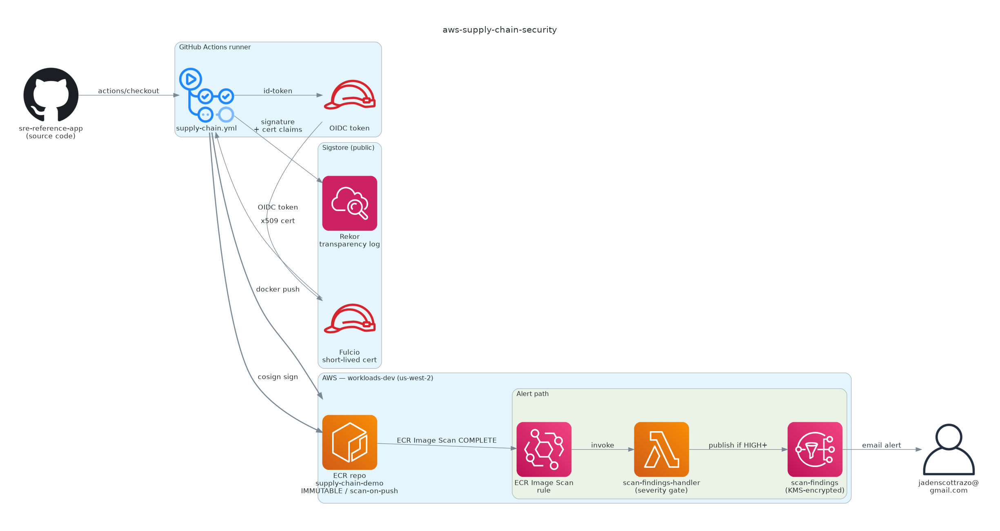

# aws-supply-chain-security

Container supply-chain security on AWS — every image that leaves CI is **SBOM-inventoried, vulnerability-scanned, and cryptographically signed** before it can be deployed. Signature verification is non-optional in the deploy path; a missing or mismatched signature fails the build.

> **Status**: shipped (2026-05-07). Always-on cost: **$0/mo** (free tier).
> **Live evidence**: see `screenshots/` and `docs/`. Cosign signatures for every pushed image are publicly verifiable via the [Sigstore Rekor transparency log](https://search.sigstore.dev/).

---

## What this proves

| Skill | Demonstrated by |
|---|---|
| **SBOM generation** | `syft` step in `supply-chain.yml`; SPDX JSON uploaded as workflow artifact |
| **Vuln scanning** | `grype` with `severity-cutoff: high` — pipeline fails the build at HIGH+ before push |
| **Keyless signing** | `cosign sign` using GitHub OIDC → Sigstore Fulcio short-lived cert + Rekor transparency log; no long-lived signing key |
| **Signature verification** | Same workflow runs `cosign verify` after push, asserting cert identity matches the workflow URL |
| **ECR scan-on-push** | Repo configured with `image_scanning_configuration { scan_on_push = true }` |
| **Event-driven alerting** | EventBridge rule routes `ECR Image Scan` events to a Lambda; Lambda gates on HIGH+ severity and publishes to SNS → email |
| **Cross-account IaC** | Terraform deploys via mgmt OIDC role chained into workloads-dev `OrganizationAccountAccessRole` |
| **Immutable tags + lifecycle** | ECR repo `IMMUTABLE`, untagged images expire after 1 day, keep last 10 tagged |

---

## Architecture



Build → SBOM → scan → sign → push → verify, all from one workflow. Scan results feed an alerting path that's cleanly decoupled from the build:

| Workflow result | Where to look |
|---|---|
| Pipeline running end-to-end (sign + verify) — supply-chain run #6 | `screenshots/01-workflow-success.png` |
| Deploy gate firing (grype HIGH+ refused the push) — supply-chain run #2 | `screenshots/01b-workflow-gate-fail.png` |
| `cosign verify` output, run locally against the pushed image | `screenshots/02-cosign-verify-cli.txt` |
| `cosign tree` showing Sigstore Rekor entry attached to the image | `screenshots/02b-cosign-tree.txt` |
| ECR scan + image artifacts (image + co-located signature tag) | `screenshots/03-ecr-scan-cli.txt` |
| Syft SBOM metadata, package count, license summary | `screenshots/05-syft-sbom-excerpt.txt` |
| Synthetic Lambda invocation script (use after confirming SNS subscription) | `screenshots/04-trigger-sns-test.sh` |

```
GitHub Actions (build/scan/sign)  ──►  Sigstore Fulcio + Rekor  (signing + log)
                                  ──►  ECR (push image + .sig)
ECR scan-on-push  ──►  EventBridge  ──►  Lambda  ──►  SNS  ──►  Email
```

---

## Cost

| Resource | Driver | Estimated $/mo |
|---|---|---|
| ECR repository (≤500MB images) | Free tier | $0 |
| ECR scan-on-push | Free tier (basic scanning) | $0 |
| EventBridge rule | First 14M events free | $0 |
| Lambda (1 invoke per image push) | Free tier (1M req/mo) | $0 |
| SNS topic + email | Free tier (100 emails/mo to email subs) | $0 |
| CloudWatch Logs (7d retention) | Negligible | <$0.10 |
| **Total** | | **~$0** |

---

## Run modes

The supply-chain workflow takes a `mode` input that controls the deploy gate:

- `gate` (default): grype with `severity-cutoff: high, only-fixed: true, fail-build: true`. HIGH+ vulnerabilities with available fixes break the build before push. **This is the production setting.**
- `demo`: same scan, same SARIF upload, but `fail-build: false` so the pipeline continues to sign + verify even when the source has known fixable vulns. Used when demonstrating the full sign-and-verify path or when consciously accepting risk on a deadline.

Mode is recorded in the `$GITHUB_STEP_SUMMARY` of every run.

## Smoke test

After applying `infra/` and pushing the supply-chain workflow at least once:

```bash
# 1. The image exists in ECR
aws ecr describe-images --repository-name supply-chain-demo \
  --profile workloads_dev --region us-west-2

# 2. The signature exists alongside it
ECR_URI=$(aws ecr describe-repositories --repository-names supply-chain-demo \
  --profile workloads_dev --region us-west-2 \
  --query 'repositories[0].repositoryUri' --output text)
DIGEST=$(aws ecr describe-images --repository-name supply-chain-demo \
  --profile workloads_dev --region us-west-2 \
  --query 'sort_by(imageDetails,&imagePushedAt)[-1].imageDigest' --output text)

# 3. Signature verifies (this is the load-bearing step)
cosign verify "${ECR_URI}@${DIGEST}" \
  --certificate-identity-regexp "https://github.com/JadenRazo/aws-supply-chain-security/\.github/workflows/supply-chain\.yml@.*" \
  --certificate-oidc-issuer "https://token.actions.githubusercontent.com"

# 4. Public Rekor entry
cosign tree "${ECR_URI}@${DIGEST}"
```

A signature mismatch — for example, an image pushed by a forked workflow — will cause `cosign verify` to exit non-zero. That's the deploy gate.

---

## Repo layout

```
.
├── infra/                     # Terraform stack (ECR + EventBridge + Lambda + SNS)
│   ├── ecr.tf                 # repo, lifecycle, repo policy
│   ├── eventbridge.tf         # rule + target + permission
│   ├── lambda.tf              # role, function, log group
│   ├── sns.tf                 # topic, email subscription
│   ├── data.tf                # SSM lookups for landing-zone foundation
│   ├── lambda/
│   │   └── scan_findings_handler.py
│   └── README.md              # apply + verify + teardown
├── .github/workflows/
│   ├── plan.yml               # PR-triggered terraform plan, posts to PR
│   ├── apply.yml              # workflow_dispatch terraform apply
│   └── supply-chain.yml       # build → SBOM → scan → sign → push → verify
├── docs/
│   ├── architecture.png
│   ├── sbom-vs-vuln-scan.md
│   ├── cosign-keyless-signing.md
│   └── what-id-do-differently.md
└── screenshots/               # workflow run, cosign verify, ECR scan, SNS email, syft SBOM
```

---

## Foundation reuse

This repo doesn't reinvent the OIDC trust, account map, or auto-stop policy — those live in [`sre-landing-zone`](https://github.com/JadenRazo/sre-landing-zone). Specifically:

- Workflows assume `arn:aws:iam::569239324174:role/GitHubActionsTerraformRunner` (mgmt), then chain into `workloads-dev`'s `OrganizationAccountAccessRole`
- Account IDs are read from SSM `/sre-landing-zone/account-map` (no hardcoded IDs)
- Resources are tagged `Environment=dev` so the landing-zone auto-stop Lambda will scale them to zero overnight if I forget

---

## Cert mapping

- **CCSP Domain 4** — Cloud Application Security (image hardening, signing, SBOM, supply-chain attestation)
- **AWS Security Specialty** — automation around ECR scan results, EventBridge-driven response
- **Adjacent skills**: SLSA framework concepts, Sigstore ecosystem, AWS Lambda + EventBridge patterns

---

## Source image

The image being signed is built from [`sre-reference-app`](https://github.com/JadenRazo/sre-reference-app)'s `app/Dockerfile` (Python 3.12-slim, gunicorn, port 8080, non-root). The supply-chain workflow `actions/checkout`s that repo at the pinned ref and builds locally — no external base-image dependency beyond `python:3.12-slim` from Docker Hub.

---

## License

MIT — see `LICENSE`.
